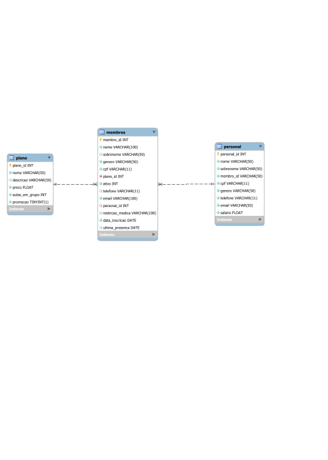

# 23-2-md-proj-sql-borafit

Membros: Lincoln e Giovana


### Guia para utilização:

1 - Realize a instalação das dependências :
```
pip install -r requirements.txt
```

2 - Faça a criação de um arquivo .env seguindo o exemplo do .env.example **(NUNCA COMMITE O ARQUIVO .env)**
```
MD_DB_SERVER="localhost" <- insira o ip
MD_DB_USERNAME="username" <- insira aqui seu username
MD_DB_PASSWORD="123456" <- insira aqui sua senha
```

3 -Edite dentro do arquivo ```database.py``` o nome da database que você quer trabalhar:
```
...
host=os.getenv('MD_DB_SERVER')
user=os.getenv('MD_DB_USERNAME')
password=os.getenv('MD_DB_PASSWORD')
database_name = "edite_aqui" 
...
```
4 - Após adicionar o .env e nomear o banco de dados rode os comandos:
```
cd ./projeto # Aonde está o projeto
uvicorn main:app --reload # Para rodar o servidor
```
Ele irá rodar o seu servidor , por padrão, em : http://127.0.0.1:8000 ou http://localhost:8000

5 - Com isso sua aplicação já estará rodando e você pode ter acesso a documentação em : http://127.0.0.1:8000/docs

6 - Uma lista completa das rotas também pode ser encontrada no arquivo ```rotas.md```.

Quando iniciado será criado um banco de Dados seguindo o diagrama :



link para o vídeo entrega1: https://youtu.be/ALvt-iEDa_g

Link para o vídeo entrega2:  

